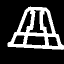
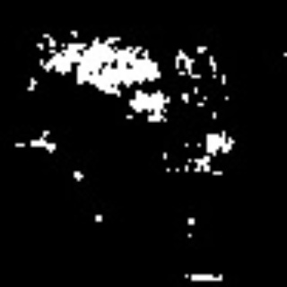
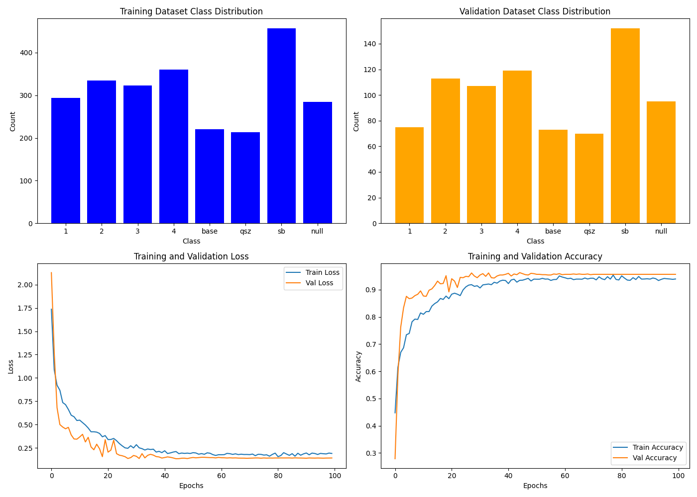

# TrainONNXClassifier

## 项目简介
本项目为RM2025赛季的神经网络分类模型训练代码。通过卷积神经网络（CNN）实现图像分类，支持多分类任务。模型经过训练后，将被转换为 ONNX 格式以便于在多种平台上部署。

- **输入图像尺寸**：64x64
- **分类类别**：
  - `1`
  - `2`
  - `3`
  - `4`
  - `base`
  - `qsz`
  - `sb`
  - `null`

## 文件结构

```
project/
├── datasets/           # 数据集目录
│   ├── train/          # 训练数据
│   └── val/            # 验证数据
├── train.py         # 训练脚本
├── training_report.png # 训练过程可视化图表
├── best.onnx           # 转换后的 ONNX 模型
└── training_info.txt   # 训练信息
```

## 环境要求

运行本项目需要以下依赖：

- Python == 3.8
- TensorFlow >= 2.14
- tf2onnx
- ONNX
- matplotlib
- numpy

安装依赖：
```bash
pip install tensorflow tf2onnx onnx matplotlib numpy
```

## 数据准备

1. 创建 `datasets/train` 和 `datasets/val` 目录，将每个类别的图像数据放入对应的子文件夹。
2. 为了保证顺序一定，按此列表下标（['1', '2', '3', '4', 'base',  'qsz', 'sb', 'null']）而不是真实类别名进行分类
3. 例如：

```
datasets/
├── train/
│   ├── 0/     # 1 的数据集
│   ├── 1/     # 2 的数据集
│   ├── ...
│   └── 7/  # null 的数据集
└── val/
    ├── 0/     # 1 的数据集
    ├── 1/     # 2 的数据集
    ├── ...
    └── 7/  # null 的数据集
```
### 示例数据集
 
 
 
 


## 运行步骤

### 1. 运行训练脚本

运行以下命令开始训练：
```bash
python train.py
```

### 2. 输出结果

训练完成后，生成以下文件：

- **`training_report.png`**: 包含训练过程中的准确率和损失曲线，以及训练/验证集类别分布的柱状图。
- **`best.onnx`**: 训练好的 ONNX 格式模型。
- **`training_info.txt`**: 包含模型结构、训练参数和统计信息的详细描述。

## 可视化结果

训练完成后，可在 `training_report.png` 中查看训练和验证的损失及准确率变化趋势，以及数据分布情况。

### 示例training_report.png



### 示例training_info.txt

```
训练时长: 750.56 秒
训练集样本总数: 2488
验证集样本总数: 804
训练批次大小: 16
验证批次大小: 16
训练轮数: 100
模型概况:
Model: "sequential"
_________________________________________________________________
 Layer (type)                Output Shape              Param #   
=================================================================
 conv2d (Conv2D)             (None, 62, 62, 32)        896       
                                                                 
 batch_normalization (BatchN  (None, 62, 62, 32)       128       
 ormalization)                                                   
                                                                 
 max_pooling2d (MaxPooling2D  (None, 31, 31, 32)       0         
 )                                                               
                                                                 
 conv2d_1 (Conv2D)           (None, 29, 29, 64)        18496     
                                                                 
 batch_normalization_1 (Batc  (None, 29, 29, 64)       256       
 hNormalization)                                                 
                                                                 
 max_pooling2d_1 (MaxPooling  (None, 14, 14, 64)       0         
 2D)                                                             
                                                                 
 conv2d_2 (Conv2D)           (None, 12, 12, 128)       73856     
                                                                 
 batch_normalization_2 (Batc  (None, 12, 12, 128)      512       
 hNormalization)                                                 
                                                                 
 max_pooling2d_2 (MaxPooling  (None, 6, 6, 128)        0         
 2D)                                                             
                                                                 
 conv2d_3 (Conv2D)           (None, 4, 4, 256)         295168    
                                                                 
 batch_normalization_3 (Batc  (None, 4, 4, 256)        1024      
 hNormalization)                                                 
                                                                 
 max_pooling2d_3 (MaxPooling  (None, 2, 2, 256)        0         
 2D)                                                             
                                                                 
 flatten (Flatten)           (None, 1024)              0         
                                                                 
 dense (Dense)               (None, 256)               262400    
                                                                 
 dropout (Dropout)           (None, 256)               0         
                                                                 
 dense_1 (Dense)             (None, 8)                 2056      
                                                                 
=================================================================
Total params: 654,792
Trainable params: 653,832
Non-trainable params: 960
_________________________________________________________________


训练参数:
优化器: Adam
损失函数: Categorical Crossentropy
评估指标: Accuracy

模型输入输出信息:
输入: (None, 64, 64, 3)
输出: (None, 8)
输入数据类型: <dtype: 'float32'>
输出数据类型: <dtype: 'float32'>
```

## 模型转换

训练完成后，模型会被自动转换为 ONNX 格式，并保存为 `best.onnx`。

如需手动执行转换，可参考以下代码：
```python
import tf2onnx
import onnx
from tensorflow.keras.models import load_model

# 加载 Keras 模型
model = load_model('your_model.h5')

# 转换为 ONNX
onnx_model, _ = tf2onnx.convert.from_keras(model)

# 保存 ONNX 模型
onnx.save_model(onnx_model, "model.onnx")
```

## 自定义配置

可通过修改 `training.py` 中的以下参数自定义训练过程：

- **学习率调度器**:
  ```python
  lr_scheduler = ReduceLROnPlateau(
      monitor='val_loss',
      factor=0.5,
      patience=5,
      verbose=1,
      min_lr=1e-6
  )
  ```

- **优化器**: 将 `optimizer='SGD'` 修改为其他优化器（如 `Adam`）。（实测效果不如SGD）

- **数据增强**: 在 `ImageDataGenerator` 中添加或修改参数。

## 备注

- 确保训练和验证数据按照类别分开存放，每个类别的文件夹名称应唯一。
- 训练时长和性能可能因数据集大小和硬件配置而异。

## 作者

- 作者：Interweave
- 邮箱：interweave@qq.com
- 日期：2024 年 12 月

